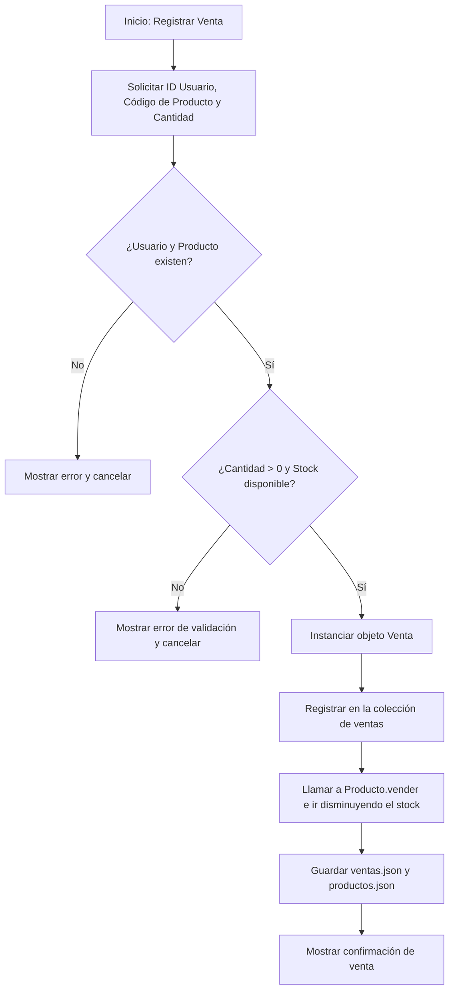

# restaurante_app - Semana 11

Este proyecto es una evolución del sistema de restaurante desarrollado para la asignatura de **Programación Orientada a Objetos**. En esta entrega (Semana 11), se incorporó el control de stock en los productos, la entidad `Venta` que establece una relación Usuario-Producto y la persistencia completa de productos, usuarios y ventas utilizando archivos JSON.

## Estudiante
* **Nombre Completo:** [Tu Nombre Completo]
* **Usuario:** gynmas

---

## Estructura del Proyecto

El código está organizado de manera modular bajo la siguiente estructura:

```text
restaurante_app/
├── datos/
│   ├── productos.json
│   ├── usuarios.json
│   └── ventas.json
├── modelos/
│   ├── __init__.py
│   ├── producto.py
│   ├── usuario.py
│   └── venta.py
├── servicios/
│   ├── __init__.py
│   ├── archivo_servicio.py
│   └── restaurante.py
├── main.py
└── README.md
```

### Responsabilidad de los Componentes

1. **`modelos/producto.py`**: Define la clase `Producto`, validando que sus atributos (código, nombre, categoría, precio, stock) cumplan con las reglas de negocio. Contiene el método `vender(cantidad)` para decrementar stock y soporte para serialización con `a_diccionario()` y `desde_diccionario()`.
2. **`modelos/usuario.py`**: Define la clase `Usuario` y valida identificación, nombre y formato básico del correo electrónico.
3. **`modelos/venta.py`**: Nueva entidad que relaciona a un usuario registrado (`usuario_id`) con un producto comprado (`producto_codigo`) y la cantidad vendida.
4. **`servicios/restaurante.py`**: Servicio que contiene la lógica del negocio. Gestiona colecciones de memoria, valida existencias de usuarios y productos, y procesa la venta (`vender_producto`) controlando el stock y registrando cada transacción.
5. **`servicios/archivo_servicio.py`**: Servicio que gestiona de manera centralizada la lectura y escritura en los archivos JSON (`productos.json`, `usuarios.json`, `ventas.json`). Controla excepciones relacionadas con el sistema de archivos y codificación JSON.
6. **`main.py`**: Punto de entrada de la aplicación. Coordina el menú interactivo, lee las entradas del usuario por teclado y muestra las respuestas del sistema.

---

## Flujo de Venta e Integración del Stock

La venta de un producto se realiza mediante la interacción de varios elementos:



---

## Persistencia de Datos

Toda la información se guarda automáticamente después de cada operación de modificación:
* **Registrar un usuario** guarda la colección de usuarios en `datos/usuarios.json`.
* **Registrar/Actualizar/Eliminar un producto** guarda la colección de productos en `datos/productos.json`.
* **Realizar una venta** actualiza y guarda el archivo `datos/ventas.json` y los stocks modificados en `datos/productos.json`.

Al iniciar la aplicación, `ArchivoServicio` carga automáticamente las tres colecciones desde el disco, reconstruyendo los objetos para el uso continuo en memoria.

---

## Manejo de Excepciones

El sistema controla de manera explícita las siguientes excepciones críticas:
1. **`FileNotFoundError`**: Permite al programa iniciar con colecciones vacías si los archivos JSON correspondientes no han sido creados aún.
2. **`json.JSONDecodeError`**: Captura errores cuando el archivo JSON tiene un formato inválido o está corrompido, evitando que la aplicación se caiga y notificando al usuario.
3. **`PermissionError`**: Informa al usuario en caso de que la aplicación no tenga permisos de lectura o escritura sobre los directorios o archivos de datos.
4. **`KeyError`**: Manejado durante la reconstrucción de objetos desde JSON si faltase algún campo esperado.
5. **`ValueError`**: Empleado para la validación interna de los atributos de `Producto`, `Usuario` y `Venta`.

---

## Instrucciones de Ejecución

Para iniciar la aplicación, navegue hasta el directorio `restaurante_app` y ejecute:

```bash
python main.py
```

### Comprobaciones del Sistema (Caso de Prueba Completo)

1. **Registrar Usuario**: Opción `6`. Ingrese un usuario con ID `123`, nombre `Carlos` y correo `carlos@mail.com`.
2. **Registrar Producto**: Opción `1`. Registre un producto con código `PROD1`, nombre `Hamburguesa`, categoría `Comida`, precio `5.50` y stock inicial `10`.
3. **Realizar Venta**: Opción `9`. Ingrese la identificación `123`, el código `PROD1` y la cantidad `3`.
4. **Confirmar Stock**: Opción `5`. Listar productos y comprobar que el stock de `PROD1` disminuyó a `7`.
5. **Verificar Persistencia en Disco**: Comprobar que en `datos/ventas.json` y `datos/productos.json` la venta se ha guardado y el stock se ha actualizado a `7`.
6. **Consultar Compras**: Opción `10`. Ingrese la identificación `123` y verifique que muestre la compra de `3` Hamburguesas.
7. **Reiniciar Sistema**: Cierre el programa (Opción `11`), vuelva a iniciarlo (`python main.py`), y valide que los datos sigan estando cargados en memoria.
8. **Validar Control de Stock**: Intente vender una cantidad mayor a la disponible (ej. vender `15` unidades de un producto con stock `7`) y verifique que el sistema rechaza la transacción sin modificar ningún archivo.
