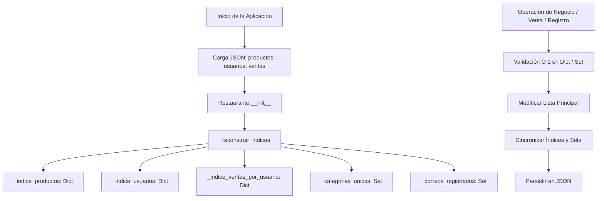

# restaurante_app - Semana 12: Colecciones Orientadas al Rendimiento

Este proyecto corresponde a la entrega de la **Semana 12** de la asignatura **Programación Orientada a Objetos**. Constituye la evolución directa de `restaurante_app` (Semana 11), incorporando **estructuras de datos y colecciones avanzadas (`dict`, `set`)** para optimizar los tiempos de respuesta en búsquedas, consultas y validaciones, eliminando recorridos lineales innecesarios ($O(n)$) mientras se conservan las listas principales para orden, iteración secuencial y persistencia en archivos JSON.

---

## Estudiante
* **Nombre Completo:** William Crespo
* **Usuario:** Furbit
* **Asignatura:** Programación Orientada a Objetos (Semestre 2 - UEA)
* **Tema:** Colecciones Orientadas al Rendimiento y Estructuras Auxiliares en Memoria

---

## Estructura del Proyecto

El código mantiene la arquitectura modular y la separación de responsabilidades establecida en el curso:

```text
├── restaurante_app/
│   ├── datos/
│   │   ├── productos.json
│   │   ├── usuarios.json
│   │   └── ventas.json
│   ├── modelos/
│   │   ├── __init__.py
│   │   ├── producto.py
│   │   ├── usuario.py
│   │   └── venta.py
│   ├── servicios/
│   │   ├── __init__.py
│   │   ├── archivo_servicio.py
│   │   └── restaurante.py
│   ├── tests/
│   │   ├── __init__.py
│   │   └── test_optimizacion.py
│   └── main.py
└── README.md
```

### Responsabilidad de los Componentes
1. **`modelos/`**:
   - `producto.py`: Entidad `Producto` con atributos validados (código, nombre, categoría, precio, stock) y método `vender(cantidad)`.
   - `usuario.py`: Entidad `Usuario` con validación de identificación, nombre y correo electrónico.
   - `venta.py`: Entidad `Venta` que modela la relación transaccional Usuario–Producto con cantidad vendida.
2. **`servicios/`**:
   - `archivo_servicio.py`: Gestión centralizada de persistencia en archivos JSON (`productos.json`, `usuarios.json`, `ventas.json`) con control robusto de excepciones de E/S y formato.
   - `restaurante.py`: Núcleo de la lógica de negocio. Mantiene las colecciones principales y las estructuras auxiliares (`dict` y `set`), gestiona la sincronización en tiempo real y la reconstrucción de índices.
3. **`tests/test_optimizacion.py`**: Suite de pruebas unitarias automatizadas (`unittest`) que valida la correcta reconstrucción de índices, búsquedas $O(1)$, consultas de ventas por usuario y sincronización de datos.
4. **`main.py`**: Interfaz de consola interactiva. No asume responsabilidades de negocio ni indexación, delegando todo al servicio `Restaurante`.

---

## Mejoras de Rendimiento y Colecciones Utilizadas

En las versiones anteriores, el servicio dependía exclusivamente de listas (`list`) para todas las operaciones. A medida que el volumen de datos crece, los recorridos secuenciales degradan el rendimiento. En esta entrega se implementaron las siguientes optimizaciones:

### 1. Cuadro Comparativo de Complejidad Temporal

| Operación | Versión Anterior (Semana 11) | Versión Optimizada (Semana 12) | Colección Empleada | Justificación Técnica |
| :--- | :---: | :---: | :---: | :--- |
| **Buscar producto por código** | $O(n)$ (recorrido de lista) | **$O(1)$** (acceso directo) | `dict` (`_indice_productos`) | Mapeo hash `codigo -> Producto`. Acceso instantáneo por clave única. |
| **Validar código existente al registrar** | $O(n)$ (recorrido de lista) | **$O(1)$** (búsqueda en clave) | `dict` (`_indice_productos`) | Verificación de pertenencia en tabla hash antes de insertar. |
| **Buscar usuario por identificación** | $O(n)$ (recorrido de lista) | **$O(1)$** (acceso directo) | `dict` (`_indice_usuarios`) | Mapeo hash `identificacion -> Usuario`. |
| **Validar ID de usuario al registrar** | $O(n)$ (recorrido de lista) | **$O(1)$** (búsqueda en clave) | `dict` (`_indice_usuarios`) | Validación instantánea sin recorrer la lista de usuarios. |
| **Validar unicidad de correo** | $O(n)$ (búsqueda en lista) | **$O(1)$** (pertenencia en set) | `set` (`_correos_registrados`) | Conjunto hash con correos normalizados en minúsculas. |
| **Consultar ventas de un usuario** | $O(m)$ (recorrido de **todas** las ventas) | **$O(1)$** (acceso directo a sublista) | `dict` (`_indice_ventas_por_usuario`) | Mapeo `usuario_id -> list[Venta]`. Solo se recuperan las ventas de ese usuario específico sin escanear el historial general. |
| **Consultar categorías únicas** | $O(n)$ (set comprehension) | **$O(1)$** (copia de conjunto existente) | `set` (`_categorias_unicas`) | Conjunto mantenido dinámicamente en cada inserción, edición o borrado. |

> **Nota:** $n$ representa la cantidad de productos o usuarios, y $m$ representa la cantidad total de transacciones de venta en el sistema.

---

## Reconstrucción y Sincronización de Índices

### Reconstrucción en Inicio (`_reconstruir_indices`)
Al iniciar la aplicación, `ArchivoServicio` deserializa los objetos almacenados en los archivos JSON y los entrega a `Restaurante`. El constructor ejecuta automáticamente `_reconstruir_indices()`, el cual:
1. Puebla `_indice_productos` con los productos recuperados y agrega sus categorías a `_categorias_unicas`.
2. Puebla `_indice_usuarios` con los usuarios registrados, almacena sus correos en `_correos_registrados` e inicializa sus listas en `_indice_ventas_por_usuario`.
3. Recorre las ventas recuperadas y las clasifica directamente en `_indice_ventas_por_usuario[usuario_id]`.

### Sincronización en Tiempo Real
Todas las estructuras auxiliares se mantienen en sincronía estricta con las listas principales:
* **`registrar_producto`**: Agrega a `_productos`, indexa en `_indice_productos` y añade la categoría a `_categorias_unicas`.
* **`actualizar_producto`**: Localiza en $O(1)$ mediante el índice y actualiza los campos. Si la categoría cambió, sincroniza `_categorias_unicas`.
* **`eliminar_producto`**: Remueve el objeto de `_productos`, elimina la clave de `_indice_productos` y sincroniza las categorías.
* **`registrar_usuario`**: Valida duplicados de ID y correo en $O(1)$, inserta en `_usuarios`, indexa en `_indice_usuarios`, registra el correo en `_correos_registrados` e inicializa el bucket en `_indice_ventas_por_usuario`.
* **`vender_producto`**: Valida usuario y producto en $O(1)$, descuenta el stock del producto, registra la venta en la lista principal `_ventas` y la añade en $O(1)$ a `_indice_ventas_por_usuario[usuario_id]`.



---

## Persistencia de Datos y Manejo de Excepciones

La persistencia continúa operando de forma transparente en la carpeta `datos/`:
* `productos.json`: Se actualiza tras registrar, actualizar, eliminar productos o realizar ventas (reducción de stock).
* `usuarios.json`: Se actualiza tras registrar un nuevo usuario.
* `ventas.json`: Se actualiza cada vez que se concreta una venta exitosa.

### Excepciones Controladas
* **`FileNotFoundError`**: Permite al sistema arrancar con colecciones vacías e índices limpios si los archivos aún no existen.
* **`json.JSONDecodeError`**: Evita caídas si un archivo JSON está corrupto o mal formateado.
* **`PermissionError`**: Notifica problemas de permisos del sistema de archivos.
* **`KeyError` y `ValueError`**: Controlan la integridad de datos durante la deserialización y validan atributos de las clases de modelo.

---

## Guía de Ejecución y Pruebas

### 1. Ejecución del Programa Principal
Navegue al directorio `restaurante_app` y ejecute:

```bash
python main.py
```

### 2. Ejecución de la Suite de Pruebas Automatizadas
Para verificar automáticamente que todas las optimizaciones y sincronizaciones funcionan al 100%:

```bash
python -m unittest discover -s tests -p "test_*.py"
```

Resultado esperado:
```text
..........
----------------------------------------------------------------------
Ran 10 tests in 0.056s

OK
```

### 3. Comprobación Manual Paso a Paso (Caso de Prueba Completo)
1. **Comprobar búsqueda de producto $O(1)$**:
   - Seleccione la opción `2` (Buscar producto).
   - Ingrese `P001`. El sistema mostrará la "Hamburguesa Doble" con búsqueda instantánea mediante el índice.
2. **Comprobar búsqueda de usuario $O(1)$**:
   - Seleccione la opción `6` para registrar o busque uno existente (`1001`) usando la opción de venta/consulta.
3. **Comprobar consulta de ventas por usuario $O(1)$**:
   - Seleccione la opción `10` (Consultar ventas de un usuario).
   - Ingrese la identificación `1002`.
   - Se mostrarán directamente las compras de Ana Gómez (1 Pizza Familiar, 2 Refrescos Grandes) obtenidas desde el índice sin escanear todas las ventas.
4. **Realizar una nueva venta y validar stock**:
   - Seleccione la opción `9` (Realizar venta).
   - Ingrese usuario `1001`, producto `P002` (Papas Fritas) y cantidad `5`.
   - Confirme el mensaje de venta exitosa y disminución del stock de 30 a 25.
5. **Comprobar sincronización en tiempo real**:
   - Vuelva a consultar ventas del usuario `1001` (Opción `10`): la nueva compra aparecerá inmediatamente reflejada en su historial indexado.
6. **Comprobar persistencia y reconstrucción**:
   - Cierre el programa (Opción `11`).
   - Vuelva a iniciarlo con `python main.py`.
   - Verifique mediante la opción `5` que el stock se mantiene en `25` y mediante la opción `10` que la venta sigue registrada, confirmando la reconstrucción total de los índices desde JSON.
