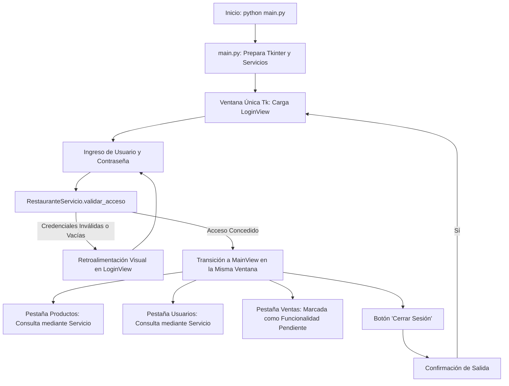

# restaurante_app - Semana 13: Conceptos Fundamentales de Interfaces Gráficas con Tkinter

Este proyecto corresponde a la entrega práctica de la **Semana 13** de la asignatura **Programación Orientada a Objetos** (UEA). En esta nueva etapa, se inicia la transición del sistema `restaurante_app` desde una aplicación basada en consola hacia una **aplicación de escritorio con interfaz gráfica de usuario (GUI)** desarrollada en **Tkinter**.

La solución adopta una **arquitectura modular en capas** basada en el modelo pedagógico del proyecto docente (*Biblioteca App*), manteniendo una estricta separación de responsabilidades entre la capa de presentación (`ui/`), la capa de negocio (`servicios/`), la capa de persistencia (`datos/` y `ArchivoServicio`) y las entidades del dominio (`modelos/`).

---

## Información del Estudiante
* **Nombre Completo:** William Gynmar Crespo Farias
* **Usuario:** Furbit
* **Asignatura:** Programación Orientada a Objetos (Semestre 2 - UEA)
* **Tema:** Conceptos fundamentales de interfaces gráficas de usuario en `restaurante_app`

---

## Estructura del Proyecto

El proyecto respeta de manera exacta la organización modular requerida:

```text
restaurante_app/
├── datos/
│   ├── productos.json
│   └── usuarios.json
├── modelos/
│   ├── __init__.py
│   ├── producto.py
│   └── usuario.py
├── servicios/
│   ├── __init__.py
│   ├── archivo_servicio.py
│   └── restaurante_servicio.py
├── ui/
│   ├── __init__.py
│   ├── login_view.py
│   └── main_view.py
├── tests/
│   ├── __init__.py
│   └── test_integracion_semana13.py
├── main.py
└── README.md
```

---

## Responsabilidad de los Componentes por Capa

### 1. Capa de Modelos (`modelos/`)
* **`producto.py` (`Producto`)**:
  * Modela los platillos y productos del restaurante con los atributos `codigo`, `nombre`, `categoria`, `precio` y `stock`.
  * Valida la integridad de datos (precios y existencias no negativas, cadenas obligatorias).
  * Incluye los métodos de serialización `a_diccionario()` y `desde_diccionario()` para interactuar de forma estandarizada con JSON.
* **`usuario.py` (`Usuario`)**:
  * Modela a los usuarios del sistema con atributos `identificacion`, `nombre` y `correo`.
  * Valida la presencia de caracteres y la estructura básica del correo (`@`).
  * Provee serialización `a_diccionario()` y `desde_diccionario()`.

### 2. Capa de Servicios y Persistencia (`servicios/`)
* **`archivo_servicio.py` (`ArchivoServicio`)**:
  * Centraliza la lectura y escritura exclusiva de los archivos `productos.json` y `usuarios.json` en codificación `utf-8`.
  * Gestiona de manera robusta excepciones de E/S (`FileNotFoundError`, `json.JSONDecodeError`, `PermissionError`), asegurando que registros malformados no provoquen caídas del sistema.
* **`restaurante_servicio.py` (`RestauranteServicio`)**:
  * Concentra la lógica de negocio y desacopla por completo la interfaz gráfica del almacenamiento en disco.
  * Recibe los datos cargados por `ArchivoServicio` y los gestiona como colecciones de objetos en memoria.
  * **Validación pedagógica de acceso (`validar_acceso`)**: Valida campos no vacíos, autentica usuarios administradores (`admin`) y comensales/usuarios registrados mediante sus credenciales pedagógicas de prueba.
  * **Consultas e inspección**: Provee métodos como `listar_productos()`, `listar_usuarios()`, `contar_productos()`, `contar_usuarios()`, `obtener_stock_total()` y filtrado por criterios de búsqueda.

### 3. Capa de Interfaz Gráfica (`ui/`)
* **`login_view.py` (`LoginView`)**:
  * Hereda de `tk.Frame` y se incrusta en la ventana principal única.
  * Contiene los campos de texto para Usuario / Identificación y Contraseña (oculta con `•`), botón de inicio de sesión y atajo con la tecla `Enter`.
  * **Retroalimentación visual**: Muestra advertencias visuales en rojo ante campos vacíos o credenciales erróneas, y confirmación en verde ante accesos válidos.
  * **Desacoplamiento**: No lee archivos JSON ni aplica lógica propia; delega la validación a `RestauranteServicio`.
* **`main_view.py` (`MainView`)**:
  * Panel principal que se visualiza tras un acceso exitoso.
  * **Cabecera superior**: Identifica el nombre de la aplicación, el usuario actualmente autenticado y un botón para **Cerrar Sesión**.
  * **Pestaña Productos**: Presenta una tabla interactiva (`ttk.Treeview`) con columnas de Código, Nombre, Categoría, Precio Unitario y Stock Disponible, acompañada de contadores de inventario y barra de búsqueda en tiempo real.
  * **Pestaña Usuarios**: Presenta una tabla (`ttk.Treeview`) con la lista de usuarios registrados (Identificación, Nombre y Correo) y buscador dinámico.
  * **Pestaña Ventas (Pendiente)**: Cumple la pauta de la rúbrica manteniendo identificada la evolución futura del módulo de ventas y facturación sin desarrollarlo prematuramente.

### 4. Punto de Entrada (`main.py`)
* Coordina la creación de una **única instancia de `tk.Tk()`** y un **único ciclo `mainloop()`**.
* Prepara las dependencias (`ArchivoServicio` y `RestauranteServicio`).
* Gestiona un contenedor dinámico que permite alternar fluidamente entre `LoginView` y `MainView` dentro de la **misma ventana principal**, destruyendo la vista anterior para optimizar memoria.

---

## Flujo de Navegación de la Aplicación

El flujo entre vistas opera en un ciclo cerrado dentro de la misma ventana de Tkinter:



---

## Credenciales de Acceso para Pruebas

Para comprobar la simulación pedagógica de autenticación, se pueden utilizar las siguientes credenciales:

| Tipo de Acceso | Usuario / Identificación | Contraseña | Rol / Descripción |
| :--- | :--- | :--- | :--- |
| **Administrador (Principal)** | `admin` | `1234` | Acceso completo al sistema de gestión |
| **Usuario Registrado** | `1001` (o ID de `usuarios.json`) | `1234` | Acceso con perfil de cliente registrado |

> **Nota:** La simulación pedagógica también acepta la identificación del propio usuario como contraseña (ej. usuario `1001`, contraseña `1001`). Si los campos se dejan vacíos o se ingresa un usuario inexistente, la interfaz responderá con mensajes de error visuales inmediatos.

---

## Guía de Ejecución y Pruebas

### 1. Ejecución de la Aplicación Gráfica
Desde la terminal, navegue a la carpeta de la aplicación y ejecute `main.py`:

```bash
cd "POO/Parcial 2/Semana 13/restaurante_app"
python main.py
```

### 2. Comprobación Paso a Paso del Funcionamiento
1. **Inicio sin errores:** Compruebe que la ventana abra centrada mostrando la pantalla de login (`LoginView`).
2. **Validación de campos vacíos:** Presione "Iniciar Sesión" sin escribir nada. Se mostrará el mensaje en rojo: *"Por favor complete todos los campos requeridos."*
3. **Validación de credenciales erróneas:** Escriba un usuario ficticio y contraseña cualquiera. Se mostrará: *"El usuario ingresado no existe en el registro."*
4. **Ingreso correcto:** Escriba `admin` y contraseña `1234`. La interfaz hará la transición hacia el panel principal (`MainView`) dentro de la misma ventana.
5. **Consulta de Productos:** Compruebe que la tabla muestre los productos cargados desde `productos.json`. Pruebe el buscador escribiendo "Hamburguesa" o "Bebida".
6. **Consulta de Usuarios:** Cambie a la pestaña "Usuarios Registrados" y verifique que se listen los usuarios cargados desde `usuarios.json`.
7. **Verificación de Ventas:** Abra la pestaña "Ventas (Próximamente)" y observe el mensaje explicativo de funcionalidad pendiente.
8. **Cierre de sesión:** Haga clic en "Cerrar Sesión" en la esquina superior derecha. Confirme el diálogo y verifique que la ventana regrese a la pantalla de login inicial.

### 3. Ejecución de Pruebas Automatizadas
Para verificar de manera programática la arquitectura en capas, las validaciones y los componentes de Tkinter:

```bash
cd "POO/Parcial 2/Semana 13/restaurante_app"
python -m unittest discover -s tests -p "test_*.py"
```

Resultado obtenido:
```text
........
----------------------------------------------------------------------
Ran 8 tests in 2.694s

OK
```

---

## Cumplimiento de Criterios de Evaluación

| Criterio | Puntos | Estado | Justificación |
| :--- | :---: | :---: | :--- |
| **1. Estructura base y separación de responsabilidades** | 2 / 2 | Cumple | Estructura canónica con `datos/`, `modelos/`, `servicios/`, `ui/` y `main.py`. `ui/` no lee JSON ni contiene reglas de negocio. |
| **2. Interfaz de acceso con Tkinter** | 2 / 2 | Cumple | `LoginView` funcional, validación delegada a `RestauranteServicio`, retroalimentación visual ante errores o campos vacíos. |
| **3. Interfaz principal y consulta mediante servicios** | 2 / 2 | Cumple | `MainView` visualiza productos y usuarios mediante `RestauranteServicio`. Sección de Ventas identificada como pendiente. |
| **4. Ejecución y funcionamiento de la aplicación** | 2 / 2 | Cumple | Una sola ventana `tk.Tk()` y un único `mainloop()`. Flujo completo login $\rightarrow$ principal $\rightarrow$ logout $\rightarrow$ login. |
| **5. Documentación del sistema** | 2 / 2 | Cumple | `README.md` exhaustivo con arquitectura, flujo, responsabilidades, credenciales y guía de ejecución. |
| **Total** | **10 / 10** | **Excelente** | |
