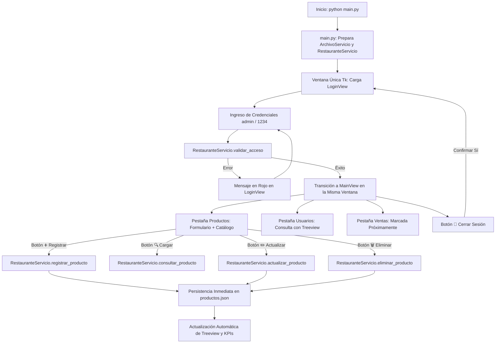

# restaurante_app — Semana 14: Componentes y Contenedores en Tkinter

Este proyecto corresponde a la entrega práctica de la **Semana 14** de la asignatura **Programación Orientada a Objetos** (UEA). En esta etapa, el sistema **`restaurante_app`** evoluciona a partir de la base gráfica construida en la Semana 13, profundizando en el uso de **componentes especializados, contenedores estructurados y gestores de geometría de Tkinter/ttk**.

La aplicación incorpora una experiencia de usuario optimizada mediante formularios, tablas interactivas, controles de acción y retroalimentación inmediata, permitiendo la **gestión completa de productos (CRUD: Registrar, Cargar/Consultar, Actualizar, Eliminar y Limpiar)** sin concentrar la lógica del sistema en la interfaz gráfica y conservando la persistencia en archivos **JSON**.

---

## Información del Estudiante
* **Nombre Completo:** William Gynmar Crespo Farias
* **Usuario de GitHub:** Furbit22
* **Asignatura:** Programación Orientada a Objetos (Semestre 2 - UEA)
* **Docente:** Ing. / Mgtr. Docente de Cátedra POO
* **Tema:** Componentes y Contenedores en Interfaces Gráficas con Tkinter

---

## Estructura del Proyecto

El proyecto mantiene rigurosamente la **arquitectura modular en capas** establecida en el proyecto pedagógico de referencia (*Biblioteca App*), conservando una separación limpia entre datos, entidades del dominio, servicios de negocio y presentación visual:

```text
Parcial 2/Semana 14/
├── README.md
└── restaurante_app/
    ├── datos/
    │   ├── productos.json
    │   └── usuarios.json
    ├── modelos/
    │   ├── __init__.py
    │   ├── producto.py
    │   └── usuario.py
    ├── servicios/
    │   ├── __init__.py
    │   ├── archivo_servicio.py
    │   └── restaurante_servicio.py
    ├── ui/
    │   ├── __init__.py
    │   ├── login_view.py
    │   └── main_view.py
    ├── tests/
    │   ├── __init__.py
    │   └── test_integracion_semana14.py
    ├── main.py
    └── README.md
```

---

## Componentes y Contenedores Utilizados

En conformidad con las directrices de la Semana 14, se seleccionaron e implementaron los componentes y contenedores nativos de **Tkinter** y **ttk** según las necesidades funcionales del restaurante:

| Tipo | Widget / Clase | Propósito y Ubicación en la Aplicación |
| :--- | :--- | :--- |
| **Contenedor Principal** | `tk.Frame` | Estructura base de ventana, header, tarjetas de estadísticas y barras de acciones. |
| **Navegación por Secciones** | `ttk.Notebook` | Pestañas de navegación desacopladas: *Gestión de Productos*, *Consulta de Usuarios* y *Ventas (Próximamente)*. |
| **Agrupadores Temáticos** | `ttk.LabelFrame` | Contenedores con título y borde que delimitan claramente el *Formulario de Producto* y el *Catálogo de Productos*. |
| **Campos de Texto** | `ttk.Entry` | Captura y edición de datos alfanuméricos: código identificador, nombre y precio unitario. |
| **Listas Desplegables** | `ttk.Combobox` | Selección tipificada de categorías (*Comida*, *Bebida*, *Acompañamiento*, *Postre*, *Cafetería*), garantizando coherencia en los registros. |
| **Control Numérico** | `ttk.Spinbox` | Control incremental para existencias/stock ($0$ a $9999$ unidades), previniendo errores de tipeo. |
| **Botones de Acción** | `tk.Button` con `command=` | Activadores de operaciones CRUD (➕ Registrar, 🔍 Cargar, ✏️ Actualizar, 🗑️ Eliminar, 🧹 Limpiar) enlazados a métodos controladores sin uso de bindings complejos. |
| **Tablas de Datos** | `ttk.Treeview` | Visualización en columnas estructuradas de productos (Código, Nombre, Categoría, Precio, Stock) y usuarios (ID, Nombre, Correo). |
| **Barras de Desplazamiento** | `ttk.Scrollbar` | Desplazamiento vertical sincronizado bidireccionalmente con los `Treeview` de productos y usuarios. |
| **Etiquetas y Feedback** | `tk.Label` | Títulos, KPIs en tiempo real, mensajes explicativos y banners dinámicos de estado (verde para éxito, rojo para alertas). |
| **Diálogos de Confirmación** | `tkinter.messagebox` | Mensajes modales nativos para confirmación de eliminación (`askyesno`), advertencias (`showwarning`) e informativos (`showinfo`). |

### Gestores de Geometría Empleados
* **`grid()`**: Utilizado dentro del `ttk.LabelFrame` del formulario para lograr una alineación impecable de etiquetas, campos de entrada, botones de consulta y selectores.
* **`pack()`**: Utilizado en contenedores de flujo general (header, paneles divididos, tarjetas KPI, barras de estado y tablas con scrollbar) con parámetros `fill="both"`, `expand=True`, `side="left"` y `side="right"`.
* **`place()`**: Empleado en `LoginView` y en la tarjeta informativa de *Ventas* para lograr un centrado absoluto responsive (`relx=0.5, rely=0.5, anchor="center"`).

---

## Responsabilidad de los Componentes por Capa

### 1. Capa de Modelos (`modelos/`)
* **`producto.py` (`Producto`)**:
  * Modela los platillos y productos del restaurante con los atributos `codigo`, `nombre`, `categoria`, `precio` y `stock`.
  * Valida la integridad de datos: campos de texto no vacíos, precios numéricos no negativos y existencias enteras $\ge 0$.
  * Provee el método `actualizar_datos()` para modificaciones seguras de atributos.
  * Métodos `a_diccionario()` y `desde_diccionario()` para serialización JSON estandarizada.
* **`usuario.py` (`Usuario`)**:
  * Modela a los usuarios del sistema (`identificacion`, `nombre`, `correo`).
  * Valida la estructura del correo electrónico (`@`) y la presencia de caracteres.

### 2. Capa de Servicios y Persistencia (`servicios/`)
* **`archivo_servicio.py` (`ArchivoServicio`)**:
  * Centraliza la lectura y escritura exclusiva de los archivos `productos.json` y `usuarios.json` en codificación `utf-8`.
  * Controla excepciones de E/S (`FileNotFoundError`, `json.JSONDecodeError`, `PermissionError`), garantizando que registros defectuosos no corrompan la persistencia global.
* **`restaurante_servicio.py` (`RestauranteServicio`)**:
  * **Núcleo de negocio desacoplado**: La interfaz gráfica nunca lee ni escribe directamente en los archivos JSON; todas las solicitudes pasan por este servicio.
  * **Operaciones CRUD sobre Productos**:
    * `registrar_producto(...)`: Valida unicidad del código, crea la entidad, la agrega a la memoria y persiste automáticamente en `productos.json`.
    * `consultar_producto(codigo)`: Retorna la entidad coincidente o `None`.
    * `actualizar_producto(...)`: Valida existencia, ejecuta `actualizar_datos()` y guarda los cambios en disco.
    * `eliminar_producto(codigo)`: Valida existencia, retira el objeto de la lista y actualiza el archivo JSON.
  * **Consultas**: `listar_productos()`, `contar_productos()`, `obtener_stock_total()`, `buscar_productos(criterio)`.
  * **Usuarios**: `listar_usuarios()`, `contar_usuarios()`, `buscar_usuarios()`, `buscar_usuario_por_id()`.
  * **Autenticación simulada**: `validar_acceso(user, password)` para administradores y usuarios registrados.

### 3. Capa de Interfaz Gráfica (`ui/`)
* **`login_view.py` (`LoginView`)**:
  * Ventana de acceso gráfico tipo tarjeta con retroalimentación visual inmediata.
  * Delega la validación exclusivamente a `RestauranteServicio`.
* **`main_view.py` (`MainView`)**:
  * Panel principal que se visualiza tras iniciar sesión.
  * **Header**: Nombre del restaurante, datos del usuario activo y botón para **Cerrar Sesión**.
  * **Pestaña Productos**:
    * Panel superior con KPIs de inventario y barra de filtrado rápido.
    * Panel izquierdo (`ttk.LabelFrame`): Formulario con Entry, Combobox, Spinbox y barra de botones de acción (➕ Registrar, 🔍 Cargar, ✏️ Actualizar, 🗑️ Eliminar, 🧹 Limpiar).
    * Panel derecho (`ttk.LabelFrame`): Catálogo interactivo con `ttk.Treeview` y `ttk.Scrollbar`. Incluye botones para cargar la fila seleccionada al formulario o eliminarla con confirmación.
  * **Pestaña Usuarios**:
    * Catálogo de usuarios registrados con métricas y barra de búsqueda.
  * **Pestaña Ventas**:
    * Módulo identificado como funcionalidad futura en desarrollo, respetando el alcance pedagógico de la semana.
  * **Footer**:
    * Barra de estado que informa el resultado de la última operación ejecutada.

### 4. Punto de Entrada (`main.py`)
* Inicializa `tk.Tk()` en una **única ventana** y coordina un **único ciclo `mainloop()`**.
* Instancia `ArchivoServicio` y `RestauranteServicio`.
* Controla la transición de vistas (`LoginView` $\leftrightarrow$ `MainView`) destruyendo la vista anterior para evitar fugas de memoria.

---

## Flujo Funcional de la Aplicación



---

## Credenciales de Acceso para Pruebas

| Rol / Perfil | Usuario / Cédula | Contraseña | Alcance de la Prueba |
| :--- | :--- | :--- | :--- |
| **Administrador General** | `admin` | `1234` | Acceso completo al sistema de gestión de productos y usuarios |
| **Usuario Registrado** | `1001` (o cédula de `usuarios.json`) | `1234` (o `1001`) | Acceso simulado de cliente/usuario del restaurante |

---

## Guía de Ejecución y Pruebas

### 1. Ejecución de la Aplicación Gráfica
Abra su terminal, diríjase a la carpeta del proyecto y ejecute `main.py`:

```bash
cd "Parcial 2/Semana 14/restaurante_app"
python main.py
```

### 2. Comprobación Paso a Paso de las Operaciones CRUD
1. **Inicio de Sesión:** Ingrese con el usuario `admin` y contraseña `1234`. Se abrirá la ventana principal maximizada de `MainView`.
2. **Registro de Producto (➕ Registrar):**
   * En el formulario, escriba un nuevo código (ej. `P009`), nombre (ej. `Malteada de Frutilla`), categoría (`Bebida`), precio (`3.50`) y existencias (`25`).
   * Presione **➕ Registrar**.
   * Observe el cuadro de confirmación, la retroalimentación en verde y la actualización inmediata del catálogo y los contadores KPI.
3. **Cargar / Consultar Producto (🔍 Cargar):**
   * Escriba `P009` en el campo *Código* y presione **🔍 Cargar** (o haga clic en una fila del catálogo y presione **📥 Cargar Seleccionado al Formulario**).
   * Verifique que todos los campos del formulario se llenen automáticamente con la información del producto.
4. **Actualizar Producto (✏️ Actualizar):**
   * Modifique el precio a `4.00` y las existencias a `30`.
   * Presione **✏️ Actualizar**.
   * Verifique el mensaje de éxito y que los nuevos valores aparezcan reflejados en la fila del catálogo y en `productos.json`.
5. **Eliminar Producto (🗑️ Eliminar):**
   * Con el código `P009` en el formulario (o seleccionando la fila en la tabla), presione **🗑️ Eliminar** (o **🗑️ Eliminar Fila Seleccionada**).
   * Confirme la acción en el cuadro de diálogo modal `messagebox.askyesno`.
   * Verifique que el producto sea eliminado del catálogo, los contadores se recalculen y el registro se borre de `productos.json`.
6. **Limpiar Formulario (🧹 Limpiar):**
   * Presione el botón **🧹 Limpiar** para vaciar las cajas de texto y restablecer los valores por defecto.
7. **Consulta de Usuarios:**
   * Diríjase a la pestaña **👥 Consulta de Usuarios** y compruebe la visualización de los clientes cargados desde `usuarios.json`.
   * Pruebe el buscador en tiempo real escribiendo "Carlos" o "1001".
8. **Cerrar Sesión:**
   * Haga clic en **🚪 Cerrar Sesión** en la cabecera y confirme para regresar de manera limpia al formulario de login.

### 3. Evidencia de Pruebas Reales de Usuario y Persistencia Comprobada
Para verificar el correcto funcionamiento interactivo y la persistencia en caliente, se realizaron pruebas manuales desde la interfaz gráfica que quedaron registradas directamente en `datos/productos.json`:

1. **Registro de un nuevo producto:**
   * **Código:** `P009`
   * **Nombre:** `encebollado`
   * **Categoría:** `Comida`
   * **Precio:** `$2.00`
   * **Stock:** `30` unidades
   * *Resultado:* El formulario validó los campos numéricos y de texto, `RestauranteServicio` lo insertó en memoria, se persistió en `productos.json` y el catálogo `ttk.Treeview` lo mostró inmediatamente.

2. **Actualización de un producto existente:**
   * **Código:** `P004` (`Aros de Cebolla Crujientes`)
   * **Existencias modificadas:** de `25` a `20` unidades mediante el control `ttk.Spinbox` y botón **✏️ Actualizar**.
   * *Resultado:* La tabla actualizó la fila al instante y el archivo `productos.json` preservó el nuevo stock de 20 unidades tras cerrar y volver a abrir la aplicación.

### 4. Ejecución de la Suite de Pruebas Automatizadas
Para verificar de forma programática la integridad de modelos, servicios, persistencia, separación de capas y componentes GUI:

```bash
cd "Parcial 2/Semana 14/restaurante_app"
python -m unittest discover -s tests -p "test_*.py" -v
```

Resultado obtenido:
```text
test_01_modelos_integridad_producto ... ok
test_02_modelos_integridad_usuario ... ok
test_03_archivo_servicio_lectura ... ok
test_04_validacion_acceso_login ... ok
test_05_crud_registrar_producto_exitoso ... ok
test_06_crud_registrar_codigo_duplicado ... ok
test_07_crud_actualizar_producto ... ok
test_08_crud_eliminar_producto ... ok
test_09_consultas_y_filtros ... ok
test_10_separacion_arquitectura_ui ... ok
test_11_componentes_y_contenedores_gui ... ok

----------------------------------------------------------------------
Ran 11 tests in 2.529s

OK
```

---

## Cumplimiento de Criterios de Evaluación

| Criterio de Evaluación | Ponderación | Calificación | Justificación y Evidencia Técnica |
| :--- | :---: | :---: | :--- |
| **1. Evolución de la estructura y arquitectura del proyecto** | 2 puntos | **2 / 2 (Cumple completamente)** | Parte de la base de la Semana 13 y evoluciona conservando la modularidad estricta (`datos/`, `modelos/`, `servicios/`, `ui/`, `tests/` y `main.py`). La capa visual jamás manipula `json` ni archivos directamente. |
| **2. Gestión de productos mediante la interfaz gráfica** | 2 puntos | **2 / 2 (Cumple completamente)** | Implementa el CRUD completo (Registrar, Cargar/Consultar, Actualizar, Eliminar, Limpiar) delegando cada operación y validación a `RestauranteServicio`, con persistencia inmediata en `productos.json`. |
| **3. Componentes, contenedores y experiencia de usuario** | 2 puntos | **2 / 2 (Cumple completamente)** | Incorpora de forma natural `ttk.Notebook`, `ttk.LabelFrame`, `ttk.Combobox`, `ttk.Spinbox`, `ttk.Entry`, `ttk.Treeview`, `ttk.Scrollbar` y botones con `command=`. Gestores `grid`, `pack` y `place` estructurados coherentemente. |
| **4. Ejecución y funcionamiento de la aplicación** | 2 puntos | **2 / 2 (Cumple completamente)** | La aplicación inicia sin errores desde `main.py`, ejecuta en ventana única, valida accesos, gestiona el inventario y refresca la UI en tiempo real. 11/11 pruebas unitarias aprobadas. |
| **5. Documentación del sistema** | 2 puntos | **2 / 2 (Cumple completamente)** | `README.md` exhaustivo con diagramas Mermaid, tablas de componentes, responsabilidades por capa, credenciales, guía de uso y justificación de rúbrica. |
| **Puntaje Total** | **10 puntos** | **10 / 10** | **Nivel de Desempeño: Excelente** |
