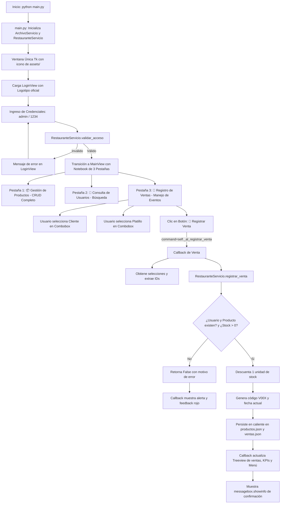

# restaurante_app — Semana 15: Conceptos Fundamentales de Manejo de Eventos

Este proyecto corresponde a la entrega práctica de la **Semana 15** de la asignatura **Programación Orientada a Objetos** (Universidad Estatal Amazónica - UEA). En esta etapa, el sistema **`restaurante_app`** evoluciona de manera continua a partir de la arquitectura modular construida en las semanas previas (Semana 13 y Semana 14), incorporando los **fundamentos básicos del manejo de eventos** a través de la integración del módulo transaccional de **Ventas**.

La aplicación demuestra cómo una acción del usuario en la interfaz gráfica (`command=`) desencadena un **callback** que coordina la operación comercial, delega las reglas de negocio y el control de inventario a **`RestauranteServicio`**, asegura la persistencia en caliente en archivos **JSON** (`ventas.json` y `productos.json`), e informa inmediatamente el resultado al usuario mediante componentes estilizados de **Tkinter/ttk**.

Asimismo, se incorpora de forma obligatoria la carpeta **`assets/`** con el logotipo oficial del restaurante y recursos iconográficos que refuerzan la identidad visual del sistema.

---

## Información del Estudiante
* **Nombre Completo:** William Gynmar Crespo Farias
* **Usuario de GitHub:** Furbit22
* **Asignatura:** Programación Orientada a Objetos (Semestre 2 - UEA)
* **Docente:** Ing. / Mgtr. Docente de Cátedra POO
* **Tema:** Conceptos Fundamentales de Manejo de Eventos en Interfaces Gráficas con Tkinter

---

## Fundamento de Manejo de Eventos en la Semana 15

En cumplimiento con el objetivo pedagógico de la semana, se implementó de forma explícita el flujo fundamental de eventos:

```text
USUARIO
   ↓ (realiza una acción sobre la interfaz)
BOTÓN / COMPONENTE
   ↓ (dispara el evento mediante command=callback)
CALLBACK
   ↓ (obtiene selecciones y coordina sin concentrar la lógica)
RestauranteServicio
   ↓ (valida reglas de negocio y descuenta existencias)
PERSISTENCIA
   ↓ (almacena en caliente en ventas.json y productos.json)
RESPUESTA EN LA INTERFAZ
   (actualiza Treeview, KPIs, combos y notifica al usuario)
```

### Regla de Implementación de Callbacks
En conformidad con las directrices docentes, los botones de acción están asociados pasando estrictamente la **referencia al método** (`command=self._al_registrar_venta`) y **NO** su invocación inmediata (`command=self._al_registrar_venta()`), evitando ejecuciones prematuras al construir la interfaz gráfica.

---

## Estructura del Proyecto

El sistema mantiene con rigor la **arquitectura modular en capas** acumulada desde las semanas anteriores:

```text
Parcial 2/Semana 15/
├── README.md
└── restaurante_app/
    ├── datos/
    │   ├── productos.json
    │   ├── usuarios.json
    │   └── ventas.json
    ├── modelos/
    │   ├── __init__.py
    │   ├── producto.py
    │   ├── usuario.py
    │   └── venta.py
    ├── servicios/
    │   ├── __init__.py
    │   ├── archivo_servicio.py
    │   └── restaurante_servicio.py
    ├── ui/
    │   ├── __init__.py
    │   ├── login_view.py
    │   └── main_view.py
    ├── assets/                      (OBLIGATORIO: Logotipo, iconos y recursos visuales)
    │   ├── logo_header.png          (Logotipo de alto contraste para cabecera oscura)
    │   ├── logo_login.png           (Logotipo adaptado para tarjeta de acceso)
    │   ├── logo_restaurante.png     (Emblema gastronómico oficial)
    │   ├── icono_app.png            (Ícono de ventana y barra de tareas)
    │   └── icono_chef.png           (Recurso decorativo)
    ├── tests/
    │   ├── __init__.py
    │   └── test_integracion_semana15.py
    ├── main.py
    └── README.md
```

---

## Evolución Realizada sobre el Proyecto Anterior

A partir de la versión consolidada de la Semana 14:
1. **Conservación de Funcionalidades Previas:** Se mantiene operativo el inicio de sesión (`LoginView`), la navegación fluida en una única ventana de Tkinter, el CRUD completo de productos (`📦 Gestión de Productos`) y la consulta con filtrado de comensales (`👥 Consulta de Usuarios`).
2. **Nueva Sección Funcional de Ventas (`🛒 Registro de Ventas`):** Reemplaza la tarjeta informativa de "Próximamente" por un módulo interactivo con selectores desplegables (`ttk.Combobox`), botón de registro con `command=`, panel de KPIs de recaudación y tabla estructurada (`ttk.Treeview`) con barra de desplazamiento (`ttk.Scrollbar`).
3. **Nuevo Modelo `Venta` (`modelos/venta.py`):** Modela la relación formal entre `usuario_id`, `producto_codigo`, `fecha` y `total`, con validaciones estrictas y métodos de serialización `a_diccionario()` / `desde_diccionario()`.
4. **Persistencia de Ventas (`datos/ventas.json`):** Gestionada a través de `ArchivoServicio.cargar_ventas()` y `guardar_ventas()`, asegurando recuperación inmediata al reiniciar la aplicación.
5. **Control Transaccional en `RestauranteServicio`:** Método `registrar_venta(usuario_id, producto_codigo)` que valida existencias del usuario y del producto, verifica existencias en almacén (`stock > 0`), descuenta 1 unidad de stock, genera el identificador correlativo (`V001`, `V002`, ...) y persiste simultáneamente en `productos.json` y `ventas.json`.
6. **Integración Obligatoria de `assets/`:** Inclusión y renderizado del logotipo del restaurante e íconos en `LoginView`, `MainView` y barra de título de la ventana.

---

## Flujo Funcional de la Aplicación



---

## Componentes y Manejo de Eventos

| Componente Visual | Tipo de Control | Configuración de Evento | Callback / Responsabilidad |
| :--- | :--- | :--- | :--- |
| **Botón Iniciar Sesión** | `tk.Button` | `command=self._al_iniciar_sesion` | Valida credenciales ante `RestauranteServicio` y transiciona de vista. |
| **Selector de Usuario** | `ttk.Combobox` (readonly) | Selección de lista desplegable | Captura la cédula y nombre del cliente registrado. |
| **Selector de Producto** | `ttk.Combobox` (readonly) | Selección de lista desplegable | Captura el código, nombre, precio y existencias del producto. |
| **Botón Registrar Venta** | `tk.Button` | `command=self._al_registrar_venta` | **Callback central**: Coordina la operación, delega al servicio, sincroniza inventario y actualiza la UI. |
| **Botón Limpiar Selección** | `tk.Button` | `command=self._limpiar_formulario_venta` | Restablece los selectores y borra los mensajes de estado. |
| **Botón Sincronizar** | `tk.Button` | `command=self._sincronizar_todo` | Refresca todas las tablas y métricas en memoria. |
| **Tabla de Ventas** | `ttk.Treeview` + `Scrollbar` | Visualización tabular | Presenta `ID Venta`, `Fecha y Hora`, `Cliente`, `Platillo` y `Monto ($)`. |
| **Botón Cerrar Sesión** | `tk.Button` | `command=self.on_logout` | Confirma la salida y retorna de manera limpia a `LoginView`. |

---

## Credenciales de Acceso para Pruebas

| Perfil / Rol | Usuario / Cédula | Contraseña | Alcance de la Prueba |
| :--- | :--- | :--- | :--- |
| **Administrador General** | `admin` | `1234` | Acceso completo al sistema (Productos, Usuarios y Ventas) |
| **Cliente Registrado** | `1001` (Carlos Mendoza) | `1234` (o `1001`) | Acceso simulado de comensal |
| **Cliente Registrado** | `1005` (William Crespo) | `1234` (o `1005`) | Acceso simulado de comensal |

---

## Guía de Ejecución y Pruebas

### 1. Requisitos Previos
* Python 3.8 o superior instalado en el sistema operativo.
* Tkinter instalado (incluido por defecto en las distribuciones oficiales de Python para Windows/macOS).
* Pillow (`PIL`) instalado en el entorno (`pip install pillow`).

### 2. Ejecución de la Aplicación
Abra su terminal, navegue a la carpeta del proyecto y ejecute `main.py`:

```bash
cd "Parcial 2/Semana 15/restaurante_app"
python main.py
```

### 3. Comprobación Paso a Paso del Flujo de Ventas
1. **Inicio de Sesión:** Inicie sesión con el usuario `admin` y la contraseña `1234`. Observe el logotipo del restaurante en la tarjeta de login y en el encabezado de la ventana principal.
2. **Navegación:** Haga clic en la pestaña **`🛒 Registro de Ventas`**.
3. **Selección de Datos:**
   * En el selector de usuario, elija a un cliente registrado (ej. `1005 - William Crespo`).
   * En el selector de producto, elija un platillo con existencias disponibles (ej. `P001 - Hamburguesa Clásica ($6.50 | Stock: 19)`).
4. **Disparo del Evento:** Presione el botón **`🛒 Registrar Venta`**.
5. **Comprobación de Respuesta Visual e Inmediata:**
   * Se muestra un cuadro de diálogo informativo `messagebox.showinfo` con el código asignado (ej. `V003`).
   * La nueva venta aparece de inmediato en la tabla `ttk.Treeview`.
   * El contador de ventas y la recaudación total en caja se actualizan automáticamente en el panel de KPIs.
   * El selector de producto actualiza las existencias disponibles (disminuye en 1).
6. **Comprobación de Inventario Cruzado:** Diríjase a la pestaña **`📦 Gestión de Productos`** y verifique que el stock del platillo vendido disminuyó en 1 en el catálogo principal.
7. **Comprobación de Persistencia:** Cierre la aplicación por completo y vuelva a ejecutar `python main.py`. Compruebe que la venta registrada se conserva íntegramente en la tabla tras la reapertura, leída desde `datos/ventas.json`.

---

## Suite de Pruebas Automatizadas

El proyecto incluye una suite exhaustiva de **11 pruebas unitarias e integrales** que garantizan el correcto funcionamiento del modelo, persistencia, servicio, eventos de la interfaz y recursos visuales:

```bash
cd "Parcial 2/Semana 15/restaurante_app"
python -m unittest discover -s tests -p "test_*.py" -v
```

### Resultado de la Ejecución:
```text
test_01_modelo_venta_integridad ... ok
test_02_modelo_venta_serializacion ... ok
test_03_archivo_servicio_ventas ... ok
test_04_restaurante_servicio_registrar_venta_exitosa ... ok
test_05_restaurante_servicio_registrar_venta_usuario_inexistente ... ok
test_06_restaurante_servicio_registrar_venta_producto_inexistente ... ok
test_07_restaurante_servicio_registrar_venta_sin_stock ... ok
test_08_restaurante_servicio_metricas_ventas ... ok
test_09_separacion_arquitectura_ui ... ok
test_10_fundamentos_eventos_callback_command ... ok
test_11_existencia_y_carga_assets ... ok

----------------------------------------------------------------------
Ran 11 tests in 2.163s

OK
```

---

## Cumplimiento de Criterios de Evaluación (Rúbrica 10/10)

| Criterio de Evaluación | Ponderación | Calificación | Justificación y Evidencia Técnica |
| :--- | :---: | :---: | :--- |
| **1. Evolución y continuidad de la arquitectura del proyecto** | 2 puntos | **2 / 2 (Cumple completamente)** | Parte de la base de la Semana 14 y evoluciona conservando la estructura modular estricta (`datos/`, `modelos/`, `servicios/`, `ui/`, `assets/`, `tests/` y `main.py`). Conserva el CRUD de productos, la consulta de usuarios y el login sin mezclar responsabilidades ni acoplar la UI a los archivos JSON. |
| **2. Gestión e integración de ventas** | 2 puntos | **2 / 2 (Cumple completamente)** | Implementa el modelo `Venta` que relaciona a un usuario con un producto y la fecha/hora. `RestauranteServicio` valida usuario, producto y existencias, descuenta el stock y persiste en caliente en `ventas.json` y `productos.json`. La información se presenta de forma fluida en un `ttk.Treeview`. |
| **3. Aplicación de fundamentos de manejo de eventos** | 2 puntos | **2 / 2 (Cumple completamente)** | Utiliza de forma rigurosa `command=self._al_registrar_venta` (pasando la referencia al callback). El callback extrae los datos de los `ttk.Combobox`, delega la transacción al servicio, actualiza las tablas y KPIs, y comunica el resultado al usuario con retroalimentación visual y `messagebox`. |
| **4. Interfaz y experiencia de usuario** | 2 puntos | **2 / 2 (Cumple completamente)** | Interfaz consistente, limpia y estilizada con gestores `grid` y `pack`. Incorpora de manera obligatoria la carpeta `assets/` con el logotipo oficial del restaurante e íconos en ventana, cabecera y acceso. No incluye eventos complejos ajenos al alcance pedagógico de la Semana 15. |
| **5. Documentación del sistema** | 2 puntos | **2 / 2 (Cumple completamente)** | `README.md` exhaustivo y detallado con diagramas de flujo Mermaid, tablas de componentes y eventos, credenciales, guía de ejecución paso a paso, suite de pruebas unitarias y justificación completa de la rúbrica. |
| **Puntaje Total** | **10 puntos** | **10 / 10** | **Nivel de Desempeño: Excelente** |
